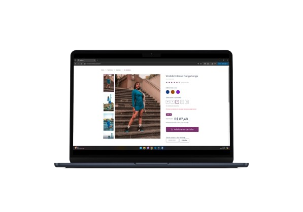

# <p align="center">Desafio - Vaga Pandanjo 🐼</p>




## 💻 Sobre
O projeto é uma página de e-commerce responsiva desenvolvida de acordo com o layout disponibilizado. Ele foi implementado com as seguintes tecnologias:
- HTML
- CSS
- JavaScript

Algumas funcionalidades que você vai encontrar ao navegar pela página:
- <strong>Zoom</strong> ao passar o mouse sobre a imagem
- Selecionar diferentes <strong>variantes</strong> do produto
- Input verificando se o <strong>CEP</strong> tem a quantidade correta de dígitos
- <strong>Toggle no container</strong> das informações disponibilizadas ao clicar.

## 💻 Acesso
Há duas opções de acesso ao projeto:
#### 🛜 Online: </br>
  Acesse pelo github pages <a href="https://brunaporato.github.io/pandanjo-test/" target="_blank">clicando aqui</a>

#### 🏡 Localmente:
Para rodar o projeto localmente siga os passos:
1. Clone este repositório
```bash
  >> git clone https://github.com/brunaporato/pandanjo-test.git
```

2. Abra a pasta do repositório e acesse o código utilizando VSCode
```bash
>> cd pandanjo-test
>> code .
```

3. Acesse o arquivo utilizando o Live Server
```bash
>> live-server index.html
```

## 🔎 Observações
O desafio foi extremamente interessante, especialmente pela oportunidade de me reconectar com a codificação em HTML, CSS e JS Vanilla após ficar muito tempo utilizando frameworks, relembrar a base é sempre muito importante e divertido. Ter uma base sólida é o caminho para o sucesso independente da linguagem. </br>
Eu gostei muito do processo e fiquei satisfeita com o resultado final, e espero que vocês também apreciem o que foi desenvolvido. </br>
<small>Até mais 💜</small>

<small style="text-align: center; display: flex; justify-content: center; gap: 3px;">
feito por <a href="https://linkedin.com/in/brunaporato" target="_blank">brunaporato</a>
</small>